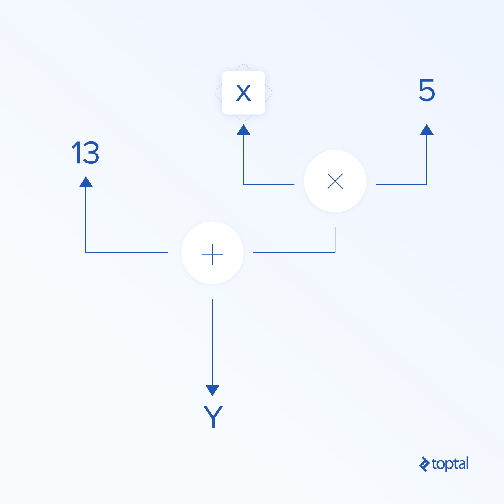

### Data Flow Graphs
In TensorFlow, computation is described using data flow graphs.
* Each **node** of the graph represents an instance of a mathematical operation (like addition, division, or multiplication)
* Each **edge** is a multi-dimensional data set (tensor) on which the operations are performed.
  * **Normal edges** transfer data structure (tensors) where it is possible that the output of one operation becomes the input for another operation

Reference:    
https://www.toptal.com/machine-learning/tensorflow-machine-learning-tutorial   
