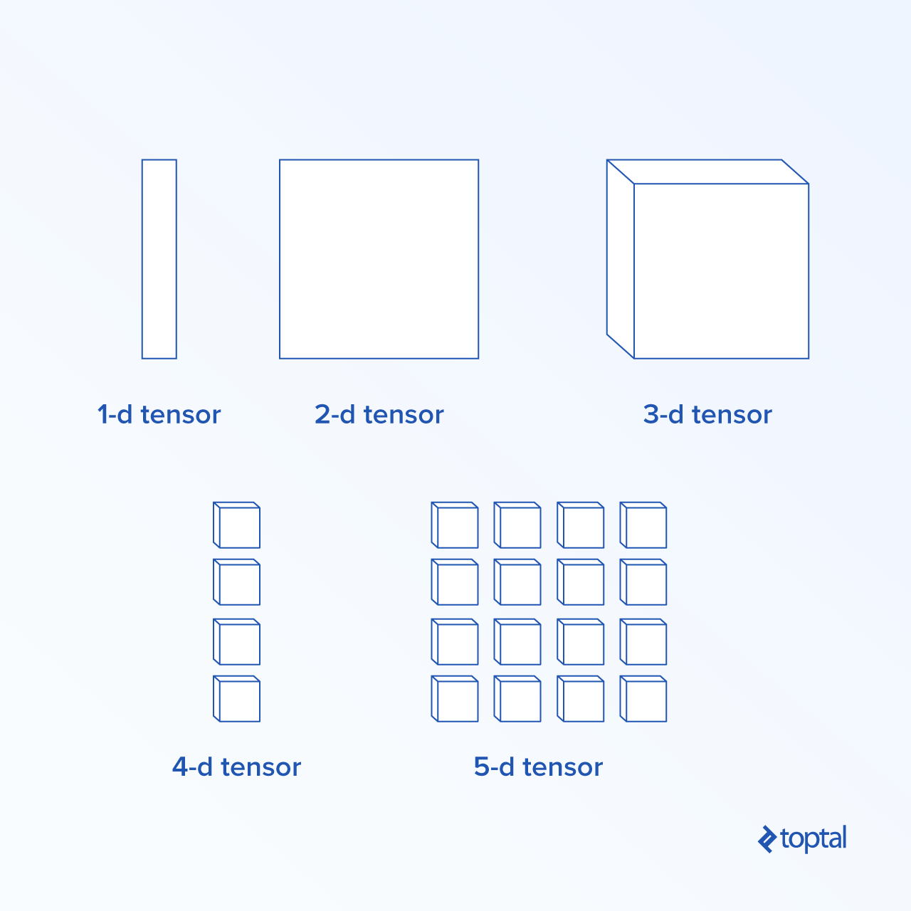

### Data Flow Graphs
In TensorFlow, computation is described using data flow graphs.
* Each **node** of the graph represents an instance of a mathematical operation (like addition, division, or multiplication)
* Each **edge** is a multi-dimensional data set (tensor) on which the operations are performed.
  * **Normal edges**, transfer data structure (tensors) where it is possible that the output of one operation becomes the input for another operation
  * **Special edges**, which are used to control dependency between two nodes to set the order of operation where one node waits for another to finish.


##### Constants
```constant(value, dtype=None, shape=None, name='Const', verify_shape=False)```
* ```value``` is an actual constant value which will be used in further computation,
* ```dtype``` is the data type parameter (e.g., float32/64, int8/16, etc.)
* ```shape``` is optional dimensions
* ```name``` is an optional name for the tensor
* ```verify_shape``` is a boolean which indicates verification of the shape of values.      
Eg1: ```z = tf.constant(5.2, name="x", dtype=tf.float32)```    
[Eg2](Codes/Constant_Ex_1.ipynb), [Eg3](Codes/Constant_Ex_2.ipynb)    

##### Variable
```k = tf.Variable(tf.zeros([1]), name="k")```    
```y = tf.Variable(x + 5, name='y')```     
Another way to use variables in TensorFlow is in calculations where that variable isn’t trainable and can be defined in the following way
```k = tf.Variable(tf.add(a, b), trainable=False)```   
[Eg1](Codes/Variable_Ex_1.ipynb), [Eg2](Codes/Variable_Ex_2.ipynb)

##### Sessions
A session encapsulates the control and state of the TensorFlow runtime. A session without parameters will use the default graph created in the current session, otherwise the session class accepts a graph parameter, which is used in that session to be executed.

In order to actually evaluate the nodes, we must run a computational graph within a session.

##### Placeholder
[Eg](Codes/PlaceHolder_Ex_1.ipynb)


##### TensorBoard 
TensorBoard is a visualization tool for analyzing data flow graphs. This can be useful for gaining better understanding of machine learning models.
```
import tensorflow as tf


x = tf.constant(-2.0, name="x", dtype=tf.float32)
a = tf.constant(5.0, name="a", dtype=tf.float32)
b = tf.constant(13.0, name="b", dtype=tf.float32)


y = tf.Variable(tf.add(tf.multiply(a, x), b))


init = tf.global_variables_initializer()


with tf.Session() as session:
    merged = tf.summary.merge_all() // new
    writer = tf.summary.FileWriter("logs", session.graph) // new


    session.run(init)
    print session.run(y)
```
Then, ```tensorboard --logdir logs/```. Now TensorBoard is started and running on the default port 6006. 

#### Mathematics with TensorFlow
**Tensors** are the basic data structures in TensorFlow, and they represent the connecting **edges** in a dataflow graph.

A tensor simply identifies a multidimensional array or list. The tensor structure can be identified with three parameters: rank, shape, and type.

* **Rank**: Identifies the number of dimensions of the tensor. A rank is known as the order or n-dimensions of a tensor, where for example rank 1 tensor is a vector or rank 2 tensor is matrix.
* **Shape**: The shape of a tensor is the number of rows and columns it has.
* **Type**: The data type assigned to tensor elements.

To build a tensor in TensorFlow, we can build an n-dimensional array. This can be done easily by using the NumPy library, or by converting a Python n-dimensional array into a TensorFlow tensor.



[Eg1](Codes/Build%20a%201-d%20tensor.ipynb): Build a 1-d tensor, by using a NumPy array   
[Eg2](Codes/Build%20a%202-d%20tensor.ipynb): Build a 2-d tensor(matrix), by using a NumPy array   

##### Tensor Operations

| TensorFlow operator | Description |
|---------------------|-------------|
| tf.add              | x+y         |
| tf.subtract         | x-y         |
| tf.multiply         | x*y         |
| tf.div              | x/y         |
| tf.mod              | x % y       |
| tf.abs              | abs(x)       |
| tf.negative         | -x          |
| tf.sign             | sign(x)     |
| tf.square           | x*x         |
| tf.round            | round(x)    |
| tf.sqrt             | sqrt(x)     |
| tf.pow              | x^y         |
| tf.exp              | e^x         |
| tf.log              | log(x)      |
| tf.maximum          | max(x, y)   |
| tf.minimum          | min(x, y)   |
| tf.cos              | cos(x)      |
| tf.sin              | sin(x)      |

TensorFlow operations listed in the table above work with tensor objects, and are performed **element-wise**. So if you want to calculate the cosine for a vector x, the TensorFlow operation will do calculations for each element in the passed tensor.      
```    
tensor_1d = np.array([0, 0, 0])
tensor = tf.convert_to_tensor(tensor_1d, dtype=tf.float64)
with tf.Session() as session:
    print(session.run(tf.cos(tensor)))
```     
Output: ```[ 1.  1.  1.]```

##### Matrix Operations
TensorFlow supports all the most common matrix operations, like multiplication, transposing, inversion, calculating the determinant, solving linear equations, and many more.   
[Eg](Codes/Matrix%20Operation%201.ipynb)

Reference:    
https://www.toptal.com/machine-learning/tensorflow-machine-learning-tutorial     
https://www.datacamp.com/community/tutorials/tensorflow-tutorial       
[TensorFlow Math](https://www.tensorflow.org/versions/master/api_guides/python/math_ops#Matrix_Math_Functions)     

##### Reduction
TensorFlow supports different kinds of reduction. Reduction is an operation that removes one or more dimensions from a tensor by performing certain operations across those dimensions. A list of supported reductions for the current version of TensorFlow can be found here. We will present a few of them in the [example](Codes/Reduction_Ex_1.ipynb).

##### Segmentation
Segmentation is a process in which one of the dimensions is the process of mapping dimensions onto provided segment indexes, and the resulting elements are determined by an index row.

Segmentation is actually grouping the elements under repeated indexes.


Eg
